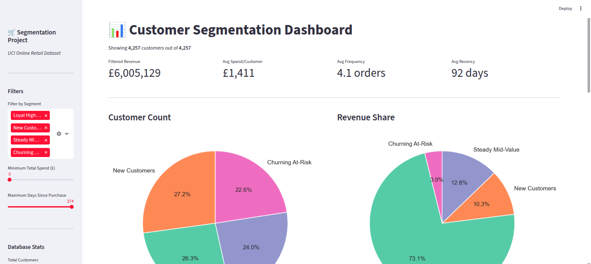

🛒 Customer Segmentation Project

    

    K-Means clustering applied to 379,000+ transactions from the UCI Online Retail dataset to identify distinct customer segments and drive targeted marketing strategies.

📊 Project Highlights

    Data Cleaning: Removed 135k+ anonymous transactions, cancelled orders, and extreme outliers.
    Feature Engineering: Transformed transactional data into 14 customer-level features (RFM + extended behavioral metrics).
    Preprocessing: Applied Log-transformations to handle heavy right-skew and StandardScaler for K-Means optimization.
    Modeling: Evaluated K=2 through K=10 using Elbow Method and Silhouette Scores. Selected K=4 for business utility.

🏷️ Segments Identified
Segment	Size	Revenue Share	Key Trait
Loyal High-Spenders	~26%	~73%	High frequency, low recency
New Customers	~27%	~10%	Short tenure, decent initial spend
Steady Mid-Value	~24%	~13%	Long tenure, low frequency
Churning At-Risk	~23%	~4%	Very high recency (~232 days)
🛠️ Tech Stack

    Python, Pandas, NumPy
    Scikit-Learn (K-Means, PCA, StandardScaler)
    Matplotlib, Seaborn
    Streamlit (Interactive Dashboard)
    Joblib (Model serialization)

🚀 How to Run

    1.Clone the repo and install dependencies:

    pip install -r requirements.txt

    2.Run the main data pipeline:

    python customer_segmentation.py

    3.Launch the interactive dashboard:

    streamlit run app.py

📁 Project Structure

customer_segmentation/
├── .gitignore
├── README.md
├── requirements.txt
├── app.py                          # Streamlit interactive dashboard
├── customer_segmentation.py        # Full ML pipeline
├── data/
│   └── Online Retail.csv           # (Ignored by git, download required)
├── models/
│   ├── kmeans_model.pkl            # (Ignored by git, generated by script)
│   └── scaler.pkl                  # (Ignored by git, generated by script)
├── notebooks/
├── outputs/
│   ├── segmented_customers.csv     # Final labeled data
│   ├── segment_summary.csv         # Aggregate stats per segment
│   ├── feature_definitions.csv     # Data dictionary for features
│   ├── 04_optimal_k.png
│   ├── 05_cluster_heatmap.png
│   ├── 06_rfm_boxplots.png
│   ├── 07_extended_boxplots.png
│   ├── 08_pca_visualization.png
│   └── 09_segment_pies.png
└── tests/
    └── test_pipeline.py            # Unit tests for pipeline validation